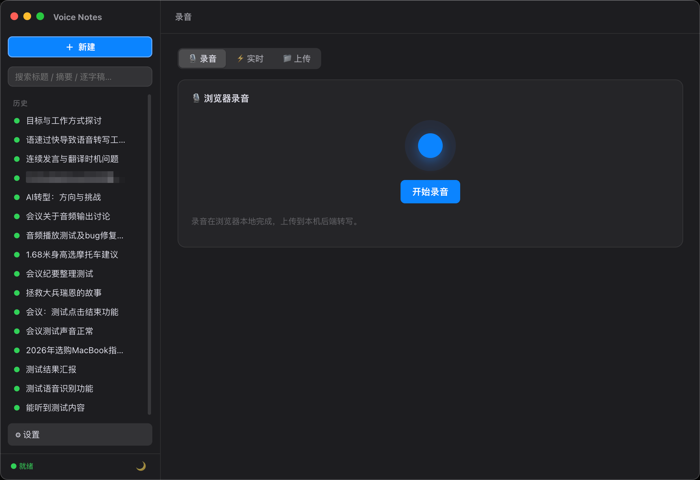
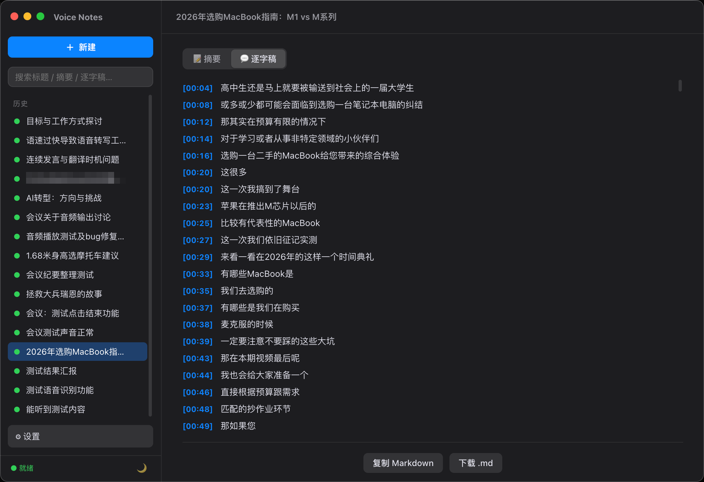
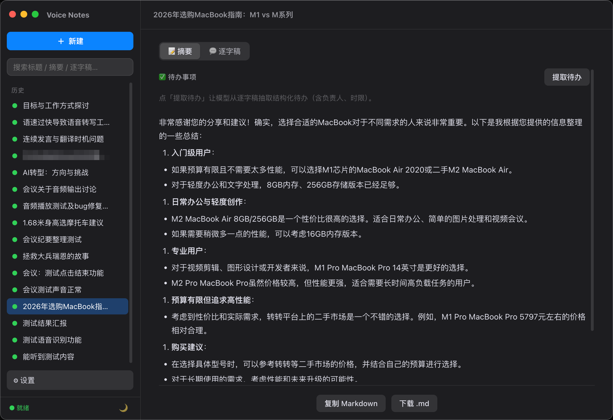
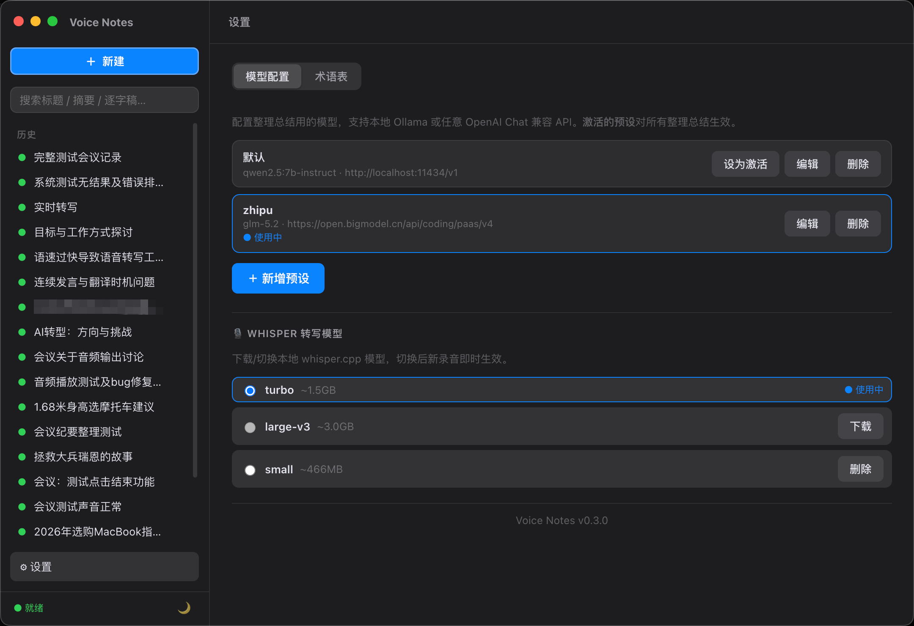

# Voice Notes · 语音转笔记 / 会议纪要

[](https://github.com/leisurehuang/VoiceNote/actions/workflows/docker.yml)
[](https://github.com/leisurehuang/VoiceNote/blob/main/LICENSE)
[](https://github.com/leisurehuang/VoiceNote/releases)
[](https://github.com/leisurehuang/VoiceNote/stargazers)

> 📎 仓库地址：<https://github.com/leisurehuang/VoiceNote>

一个**本地运行**的 Web 应用：浏览器录音或上传音频 → 本地 whisper.cpp 转写 → 本地 Ollama 生成中文摘要 → 查看逐字稿与摘要、导出 Markdown。全程不联网、数据不出本机，适合个人 / 小团队使用。

## 🎬 [演示视频](https://www.bilibili.com/video/BV11zT16ZEfg)

<p align="center">
  <a href="https://www.bilibili.com/video/BV11zT16ZEfg/"></a>
</p>

## 📸 截图

| 录音 / 上传 | 逐字稿（带时间戳，点句跳音频） |
|---|---|
|  |  |
| **结构化摘要** | **设置（模型预设 / 术语表 / 明暗主题）** |
|  |  |

## 功能

- 🎙️ **浏览器录音 / 实时转写**：浏览器录音，或边说边出字的实时转写（Chrome 产出 webm、Safari 产出 m4a，自动适配）。
- 📁 **上传音频 / 视频**：拖拽或选择 mp3、m4a、wav、webm、aiff，以及 mp4、mov 等视频（自动抽取音轨），带上传进度。
- 🔁 **三段流水线**：ffmpeg 转码（16kHz 单声道 wav）→ whisper.cpp 转写（逐字逐句实时流式）→ LLM 生成结构化摘要（token 实时流式）。进度按真实转写时长估算。
- ⚡ **实时进度**：SSE 推送，转写和摘要边出边看；实时录音时逐字稿与增量摘要滚动更新，结束后生成高质量终版摘要。
- 📝 **查看 / 编辑 / 导出**：摘要与逐字稿支持**就地编辑**保存；逐字稿带时间戳；摘要可「自定义提示重新生成」；一键复制或下载 Markdown。
- ✅ **待办抽取**：一键从逐字稿抽取结构化待办事项（任务 / 负责人 / 时限）。
- 🔍 **全文搜索**：侧栏搜索框，按标题 / 摘要 / 逐字稿过滤历史会话。
- ▶ **音频播放与逐字稿跟随**：历史会话可播放、下载原始音频；逐字稿按播放进度高亮当前句并自动滚动，点击任一句可跳转音频。
- 🩺 **依赖自检**：首页显示 ffmpeg / whisper-cli / 模型 / Ollama 是否就绪。
- ⚙️ **模型管理**：应用内保存多套 LLM 预设（本地 Ollama 或任意 OpenAI Chat 兼容 API），一键切换、测试连接，运行时即时生效；还可在设置页直接**下载 / 切换 whisper 与 ollama 模型**，免命令行。
- 📖 **术语表**：维护专有名词 / 人名 / 公司名，转写与整理时自动偏置，提升中文识别准确率。
- 🎨 **明暗主题**：auto / 浅色 / 深色三态，auto 实时跟随系统，侧栏一键切换。
- 🔒 **录音锁定**：录音 / 整理 / 上传进行中，禁止切换模式或视图，避免误操作终止录音。

## 快速开始

```bash
# 1. 装系统依赖、下模型、拉 LLM（首次，需联网）
npm run setup        # brew install whisper-cpp ffmpeg + 下载 turbo 模型 + ollama pull

# 2. 装项目依赖
npm install

# 3a. 开发模式（前端热更新 http://localhost:5173，后端 :3000）
npm run dev

# 3b. 或生产模式（单进程 http://localhost:3000）
npm run build && npm start
```

打开浏览器访问对应地址即可。生产模式下后端单进程同时托管前端和 API。

## 环境要求

- macOS（Apple Silicon 推荐，M 系列跑 whisper 很快；本机实测 M4 / 16GB）。
- Node.js 22+、Homebrew。
- 外部依赖由 `npm run setup` 自动安装：
  - `whisper-cpp`（keg-only，路径见下）、`ffmpeg`
  - Whisper 模型 `ggml-large-v3-turbo.bin`（~1.5GB，默认走 hf-mirror 镜像）
  - Ollama 模型 `qwen2.5:7b-instruct`（~4.7GB）

> `setup.sh` 用 hf-mirror.com 下载模型（国内更稳）；也可手动用任何方式下载 `.bin` 后在 `.env` 指向它。

## 配置（`.env`）

复制 `.env.example` 为 `.env`，绝大多数情况下用默认值即可：

| 变量 | 默认 | 说明 |
|---|---|---|
| `PORT` | 3000 | 后端端口 |
| `WHISPER_MODEL` | `~/.voice-notes-models/ggml-large-v3-turbo.bin` | 模型文件，可换成 large-v3 / small |
| `WHISPER_LANGUAGE` | auto | 固定中文可设 `zh`，跳过自动检测 |
| `WHISPER_PROMPT` | 以下是普通话的句子。 | 解码预热，偏置中文输出 |
| `OLLAMA_BASE_URL` | http://localhost:11434/v1 | OpenAI 兼容端点，可换成任意云 API |
| `OLLAMA_MODEL` | qwen2.5:7b-instruct | 摘要模型 |
| `OLLAMA_INCREMENTAL_MODEL` | 同 `OLLAMA_MODEL` | 实时增量摘要用的模型，缺省跟随 `OLLAMA_MODEL` |
| `INCREMENTAL_THRESHOLD_CHARS` | 280 | 实时增量摘要：新增多少字符触发一次刷新 |
| `INCREMENTAL_MIN_INTERVAL_MS` | 8000 | 实时增量摘要：两次刷新的最小间隔（毫秒） |

**换云 LLM**：推荐直接在应用内「⚙ 设置」页配置——可保存多套预设（本地 Ollama / OpenAI / DeepSeek 等）、测试连接、运行时一键切换，对所有整理总结即时生效。也可仍用 `.env` 的 `OLLAMA_BASE_URL` / `OLLAMA_MODEL` / `OLLAMA_API_KEY`（启动时作为「默认」预设）。

## 模型档位

| 模型 | 大小 | 说明 |
|---|---|---|
| `ggml-large-v3-turbo.bin` | ~1.5GB | **默认**，质量接近 large、速度快 |
| `ggml-large-v3.bin` | ~3.0GB | 中文最好，更慢更占内存 |
| `ggml-small.bin` | ~466MB | 最快，嘈杂环境偏弱 |

切换只需改 `.env` 的 `WHISPER_MODEL`（或重跑 `WHISPER_MODEL_NAME=xxx npm run setup`）。

## 架构

```
voice-notes/
├── packages/backend/   Fastify + TS：API、流水线、SSE、文件存储
│   └── src/
│       ├── pipeline/   ffmpeg.ts / whisper.ts / summarize.ts / vad.ts / orchestrator.ts
│       ├── store/      sessionStore.ts（每会话一个目录）+ settingsStore.ts（LLM 预设）
│       ├── routes/     sessions.ts（SSE/导出/重摘要/音频）+ realtime.ts（WS 实时）+ settings.ts（配置页）
│       └── config.ts   env + 依赖自检 + /api/health（llm 运行时可变）
├── packages/frontend/  Vite + React + TS：录音/上传/实时/进度/详情/设置
└── scripts/            setup.sh / fetch-model.mjs / 冒烟测试 / 打包脚本
```

- **存储**：无数据库。每个会话是 `data/sessions/<id>/` 一个目录（`meta.json` + 源音频 + `audio.wav` + `transcript.json` + `summary.md`）。服务重启会自动把「运行中」的会话重置为可重跑。
- **进度**：whisper/LLM 输出经 SSE（`/api/sessions/:id/events`）实时推送 `segment` / `summary-token` 事件。
- **可插拔 LLM**：后端只调一个 OpenAI 兼容 `/chat/completions`。

## 常见问题

- **录音没声音/权限**：浏览器需授权麦克风；Safari 用系统设置 → 隐私 → 麦克风。
- **摘要失败「无法连接 LLM」**：先 `ollama serve` 启动 Ollama。
- **首页提示缺依赖**：运行 `npm run setup`。
- **模型下载慢/失败**：`setup.sh` 默认用 hf-mirror；也可手动下载后改 `.env` 的 `WHISPER_MODEL` 指向文件。

## 开发

```bash
npm run dev          # 同时起 vite(5173) 和后端(3000)，vite 代理 /api
npm run typecheck    # 前后端类型检查
npm run build        # 构建前端到 packages/frontend/dist
```

冒烟测试（需后端在跑）：

```bash
node scripts/smoke-m2.mjs            # 上传/转码/删除
node scripts/smoke-m3.mjs <音频>      # SSE 转写 + 摘要全链路
node scripts/verify-prod.mjs         # 生产模式自检
```

## Docker 部署（服务端）

不想装 Mac app、想让多人通过浏览器用？用 Docker 跑成服务，浏览器访问即可。

镜像自带后端 + 前端 + whisper.cpp(CPU) + ffmpeg + turbo 模型；摘要用的 **Ollama + qwen** 通过 docker-compose 作为 sidecar。镜像已由 CI 自动构建并发布到 GHCR：`ghcr.io/leisurehuang/voicenote`。

```bash
# 一条命令起来（首次自动拉 qwen2.5:7b-instruct，约 4.7GB，几分钟）
docker compose up -d

# 浏览器打开 http://<服务器>:3000
# 看 qwen 拉取进度（拉完摘要才可用）：
docker compose logs -f ollama-init
```

- **数据持久化**：会话（音频/逐字稿/摘要）在 `data` 卷；Ollama 模型在 `ollama` 卷。重启不丢。
- **GPU 加速**（仅 Linux + nvidia-container-toolkit）：取消 `docker-compose.yml` 里 ollama 服务的 `deploy` 注释。Mac/无 GPU 走 CPU（转写/摘要可用，稍慢）。
- **只用镜像**（不要 Ollama sidecar）：`docker run -p 3000:3000 -v vn-data:/data -e OLLAMA_BASE_URL=http://你的ollama:11434/v1 ghcr.io/leisurehuang/voicenote:latest`。
- **自己构建**：`docker compose build` 或 `docker build -t voicenote .`（多阶段：编前端/后端 → 编 whisper.cpp → 运行镜像）。
- **架构**：CI 默认出 amd64 镜像（适配服务器）。arm64（如树莓派/Mac）需本地 `docker build`，或给 `docker.yml` 加 `platforms: linux/amd64,linux/arm64`。

> compose 里 `app` 同时写了 `build: .` 和 `image:`：本地没镜像就自动构建并打同名 tag；想直接用 CI 预构建镜像就先 `docker compose pull`。

## 桌面应用（全平台支持）

🎉 **现已支持 Windows、Linux、macOS 全平台桌面应用！**

可打包成**双击即用的自包含应用**（Electron 原生窗口）。所有依赖——whisper-cli、ffmpeg、Ollama、whisper 模型——全部内置，无需安装任何依赖。

### 📦 下载安装

[**下载最新版本**](https://github.com/leisurehuang/VoiceNote/releases/latest)

| 平台 | 文件格式 | 说明 |
|------|----------|------|
| 🪟 **Windows** | [.exe 安装程序](https://github.com/leisurehuang/VoiceNote/releases/latest) / [portable.zip](https://github.com/leisurehuang/VoiceNote/releases/latest) | NSIS 安装 / 免安装绿色版 |
| 🐧 **Linux** | [.AppImage](https://github.com/leisurehuang/VoiceNote/releases/latest) | 通用格式，双击运行 |
| 🍎 **macOS** | [.dmg](https://github.com/leisurehuang/VoiceNote/releases/latest) | Apple Silicon (arm64) |

### 本地构建

```bash
npm install

# macOS (arm64)
npm run dist:mac

# Windows
npm run dist:win

# Linux
npm run dist:linux

# 全平台
npm run dist:all
```

### 自动更新

应用内置自动更新功能：
- 启动时自动检查新版本
- 后台下载更新包
- 下载完成后提示安装重启
- 支持跳过特定版本

可通过菜单「检查更新…」手动触发。

### 自动构建

GitHub Actions 自动构建全平台安装包：

- **触发**：推送 `v*` tag → 自动构建三平台安装包
- **产物**：自动上传到 GitHub Releases
- **架构**：Windows (x64)、Linux (x64)、macOS (arm64)

发版只需：

```bash
git tag v0.4.0 && git push origin v0.4.0
```

### 分发须知

- **macOS**：仅 Apple Silicon (arm64)，未签名需右键「打开」放行
- **Windows**：需要 Visual C++ Redistributable（2015-2022）
- **Linux**：AppImage 格式，添加可执行权限后运行
- **首次启动**：需联网下载模型（约 1.5GB），完成后即可离线使用

### 桌面开发模式

```bash
npm run desktop:dev   # 用系统 brew 装的 whisper/ffmpeg/ollama，弹原生窗口联调
```

## 🤝 贡献

欢迎提 [Issue](https://github.com/leisurehuang/VoiceNote/issues) 反馈问题或建议，也欢迎 Pull Request。开发流程与约定见 [CONTRIBUTING.md](CONTRIBUTING.md)。

如果这个项目对你有帮助，欢迎点 ⭐ **Star** 支持一下！

## 📄 License

[MIT](LICENSE) © 2026 [leisurehuang](https://github.com/leisurehuang)
